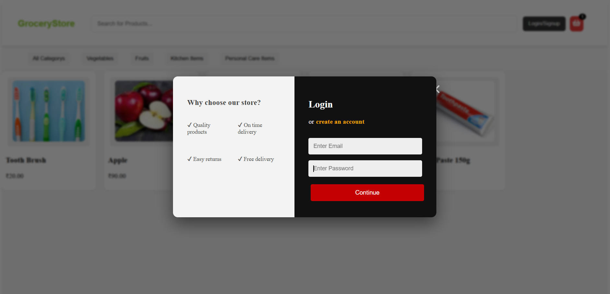
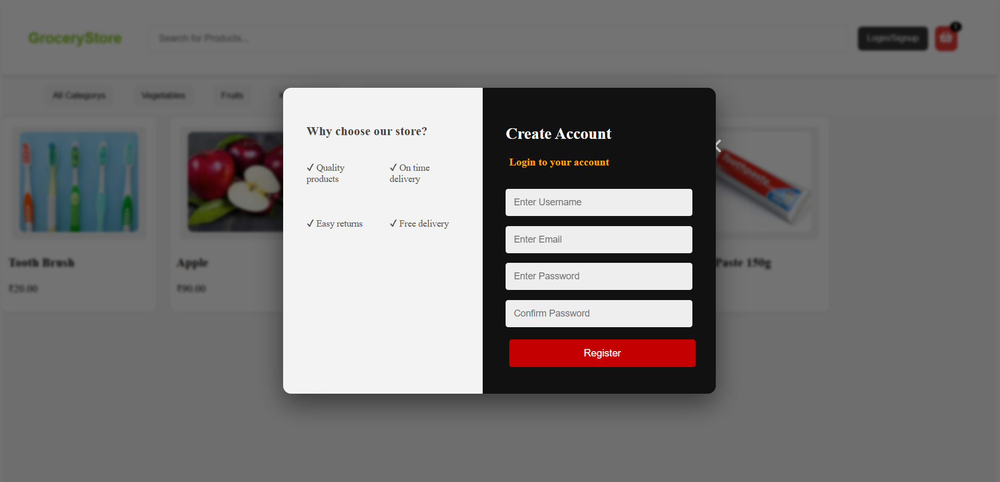
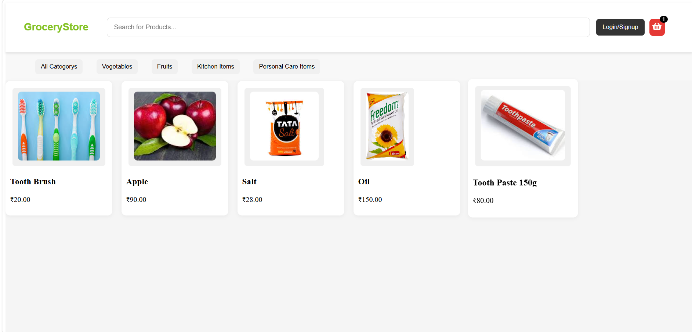
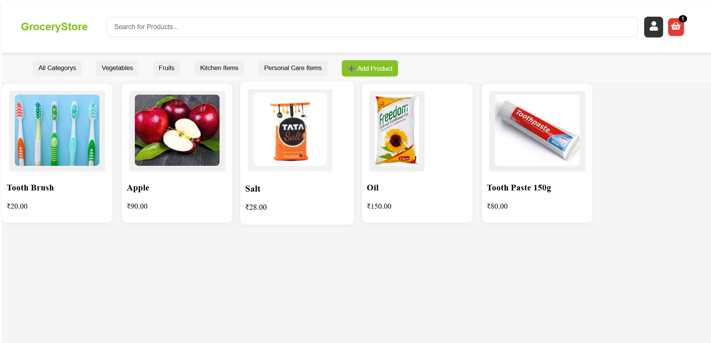
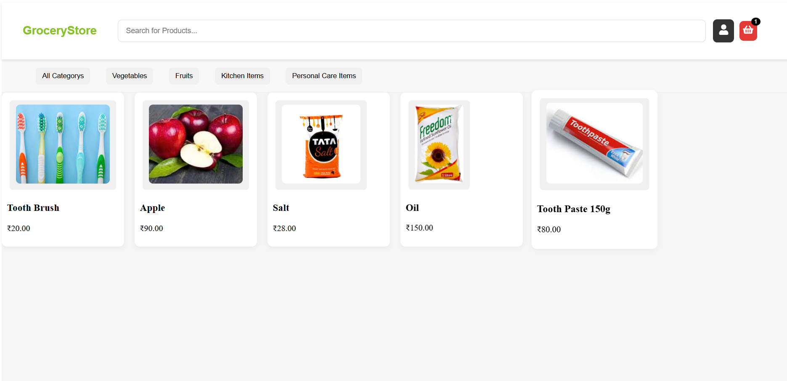
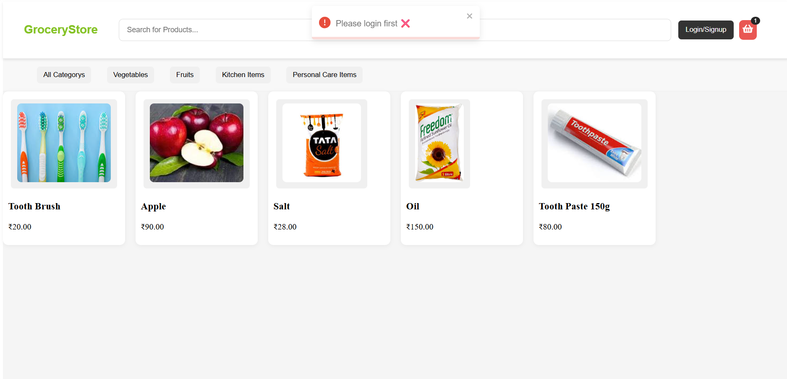
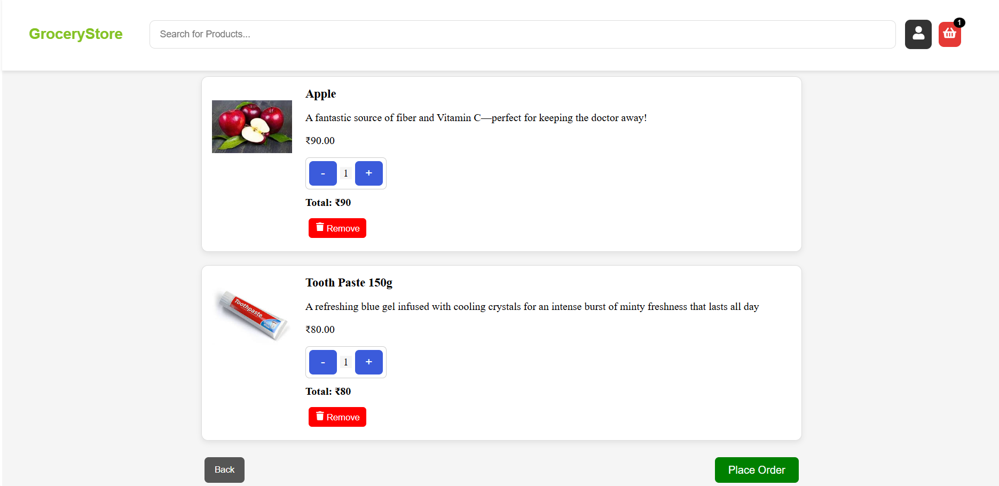
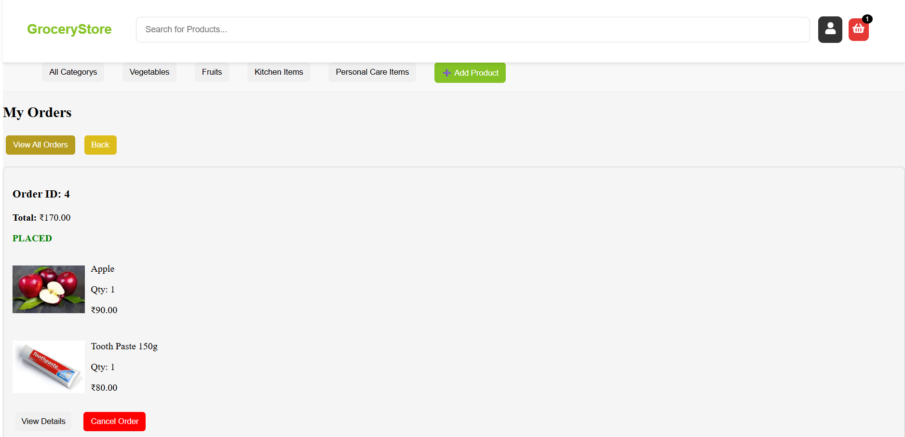

# My-GroceryStore-Project
Full-stack Grocery Store web app using Django, React, MySQL, and REST APIs. Features JWT authentication, login/registration, orders, add/remove cart, and CRUD operations.

# My Grocery Store Project
A full-stack web application for managing a grocery store. Built with Python, Django (backend), React (frontend), and MySQL database. 

## Features
- **User Authentication:** Secure login, registration, and JWT-based sessions
- **Role-Based Access:** 
  - **Admin:** Can insert, update, or delete products
  - **Normal Users:** Can view products, manage their cart, and place orders (cannot see admin buttons)
- **Cart Management:** Add or remove items from the cart
- **Order Management:** Place or remove orders
- **Per-User Tasks:** Users see only their own tasks/orders
- **REST APIs:** Backend communicates with frontend via APIs
- **CRUD Operations:** Full Create, Read, Update, Delete functionality

## Tech Stack
- Backend: Python, Django, MySQL, REST APIs
- Frontend: React, JavaScript, HTML, CSS
- Authentication: JWT
---

## **Setup Instructions**

### **Backend (Django)**
1. Navigate to the backend folder:
cd backend

2. Create a virtual environment:
python -m venv venv

3. Activate the virtual environment:
Windows:
venv\Scripts\activate
macOS/Linux:
source venv/bin/activate

4. Install dependencies:
pip install -r requirements.txt

5. Run migrations:
python manage.py migrate

6. Start the backend server:
python manage.py runserver

The backend will run at http://127.0.0.1:8000/

### **Frontend (React)**

1. Navigate to the frontend folder:
cd frontend

2. Install dependencies:
npm install

3. Start the React development server:
npm start

The frontend will run at http://localhost:3000/ and communicate with the backend APIs.

## Usage

1. Register a new account or login with existing credentials.  
2. **Admin users** can manage products (insert, update, delete).  
3. **Normal users** can browse products, add items to their cart, and place orders.  
4. Manage your grocery store tasks using CRUD operations.

## Project Highlights
Full-stack integration of Django and React
JWT authentication for secure access
Clean folder structure for scalability
Practical experience with REST APIs and database management

## Screenshots

### Login Page

### Registration Page

### Home Page

### Admin Dashboard

### Normal User Dashboard

### ViewProduct Page

### WithoutLogin can't access Cart/Orders

### User Cart Page

### User Orders Page

## Author
Nithin Chowdary
